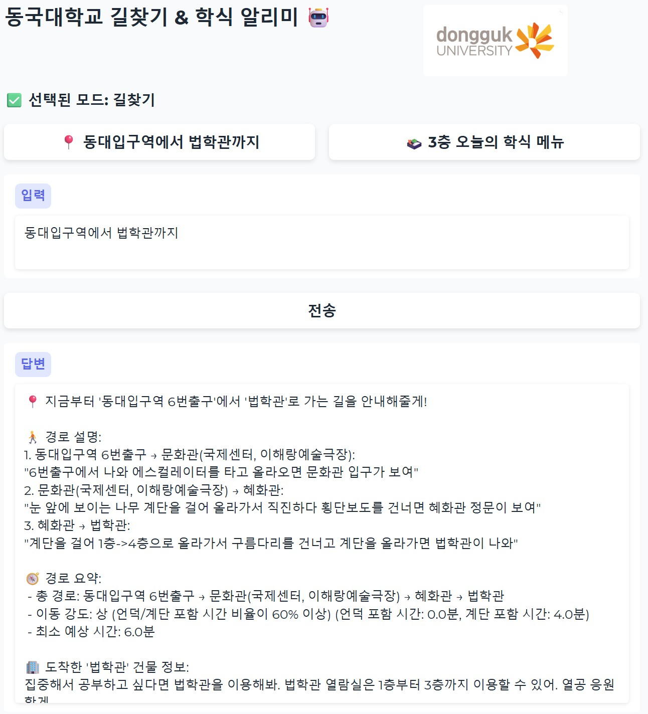
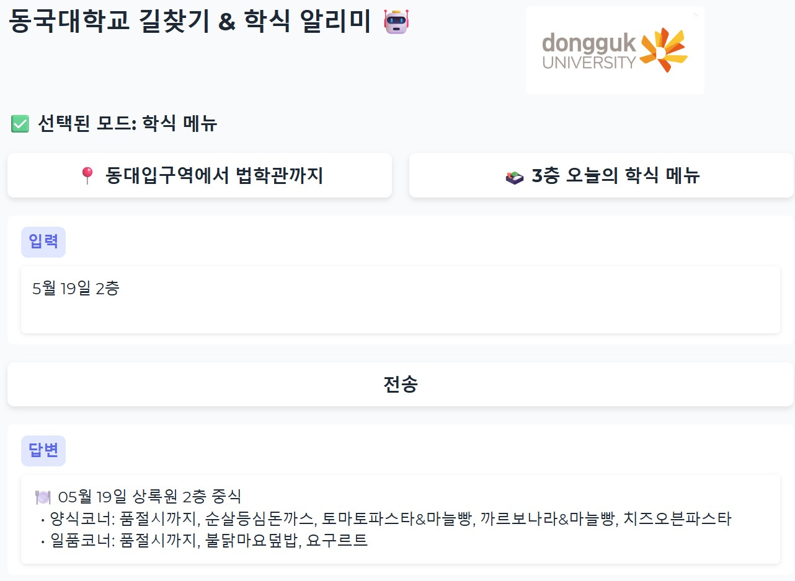

# 🐯 DGU Chatbot v1

동국대학교 구성원들을 위한 **캠퍼스 길찾기 & 학식 알리미 챗봇**입니다.  
Gradio 기반의 웹 인터페이스로, 누구나 쉽게 사용할 수 있습니다.

---

## ✨ 주요 기능

- 🧭 **캠퍼스 길찾기**
  - 출발지와 도착지를 입력하면, 언덕/계단 정보까지 고려한 최적 경로 안내
- 🍱 **상록원 학식 메뉴 확인**
  - 오늘의 학식 또는 날짜/층수 기준으로 메뉴 조회 가능
- 🤖 Gradio 기반 인터페이스
  - 웹에서 바로 사용 가능하며, 모바일 대응

---

## 📸 데모 화면

| 길찾기 기능 | 학식 기능 |
|------------|-----------|
|  |  |

> 예시: `동대입구역에서 명진관까지`, `5월 25일 3층`

---

## 🚀 실행 방법

1. 이 저장소를 클론합니다:
```bash
git clone https://github.com/won172/DGU_chatbot_v1.git
cd DGU_chatbot_v1
